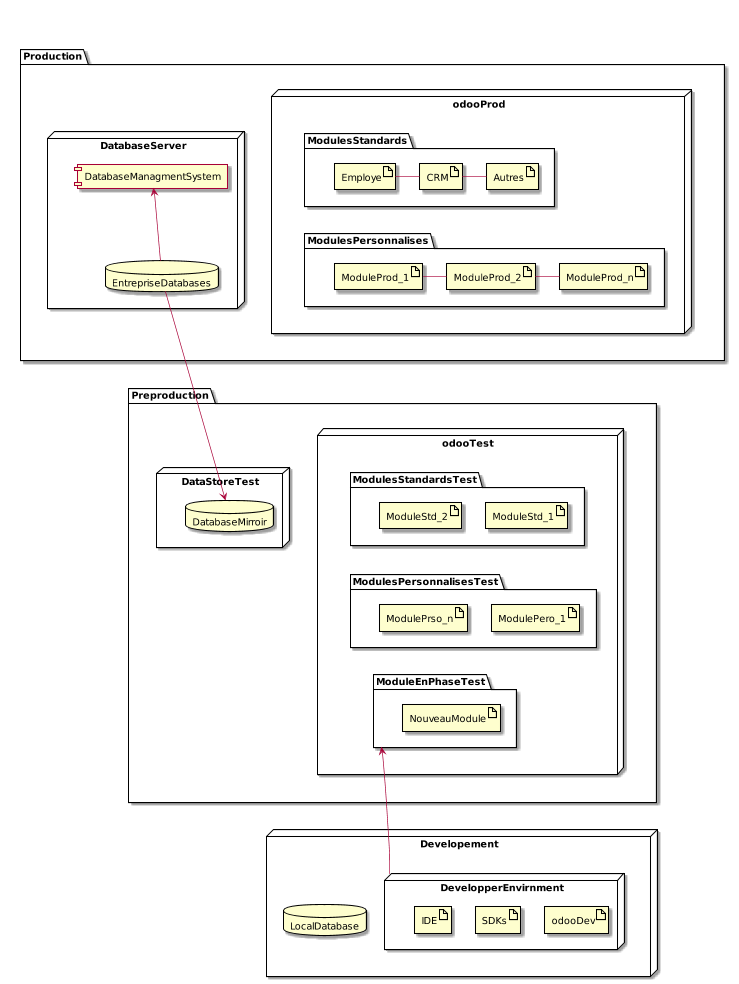

# Déployer un nouveau module dans un environment en production

Ce document décrit une approche générique préconisée pour le déploiement d'un nouveau module dans environement **odoo** déjà en production.

## Concepts

Le déploiement en production de tous système d'information d'entreprise doit se faire en respectant les bonnes pratiques internationales en matière de gestion des infrastructures des Technologies de l’Information.

De ce fait, il est préconisé de disposer de trois modes : le mode production (exploitation), le mode pré-production (stagging) et le mode développement.

* Le mode **production (exploitation)** est le mode principal accessible aux utilisateurs autorisés. Avec ce mode les utilisateurs disposeront de toutes les données et fonctionnalités mises à disposition dans le catalogue des services.
* Le mode **pré-production (stagging)** est dédié aux tests avant mise à disposition des utilisateurs finaux. C’est un environnement identique au mode production, mais qui n’est accessible qu’aux experts de l’entreprise responsables des tests et du déploiement des applications.
* Le mode **développement** est un déploiement simplifié des composants du système servant en premier lieu au développement de nouvelles fonctionnalités ou aux tests de nouveaux modules. Il n’est accessible qu’aux experts développeurs.

Aussi, afin d’assurer la continuité du service en cas de sinistre, un site de secours est préconsé dans lequel une réplication quasi exacte de l’environnement de production sera déployée. Les données et les fonctionnalités offertes à partir de ce site seront synchronisées autant que possible avec le site de production.

## Procédure

Afin de déployer un nouveau module d'odoo dans un environement en production, il est indispensable de prendre les précautions suivantes :

### Phase developement

1. faire une replication de la base de données principale dans l'environement **préproduction**.
1. appliquer les paramètres de configuration de l'environement **production** à l'environement **developpement**.
1. déployer tous les modules en **production** dans l'environement **developpement**.
1. appliquer des test unitaires sur le nouveau module avec les données réelles.
1. documenter les tests effectués.

### Phase préproduction

1. faire une replication de la base de données principale dans l'environement **préproduction**.
1. appliquer les paramètres de configuration de l'environement **production** à l'environement **préproduction**.
1. déployer tous les modules en **production** dans l'environement **préproduction**.
1. solliciter les utilisaeturs clés de tous les modules en **production** afin d'effectuer leurs opérations courantes sur le déploiement en **préproduction** pendant **_au moins une semaine_**.
1. vérifier régulièrement les fichiers logs afin de s'assurer que tous fonctionne correctement.
1. si des problèmes sont rencontrés, il est indispensable de les examiner et de reprendre à partir de la **phase développement**.

### Phase production

Si tous les tests en mode **préproduction** sont concluants :

1. planifier le mise en production en fonction de la charge de travail des utilisateurs finaux et de la nécessité de disposer des nouvelles fonctionnalités (évaluation des risques).
1. annoncer la date de déploiement du nouveau module à tous les utilisateurs et communiquer sur l'impact (positif/négatif) de ce déploiement sur les activités courantes.

Le jour du déploiement :

1. faire une sauvegarde de la base de données, des fichiers de configuration et des codes sources des modules personnalisés déployés en **production**.
1. si le déploiement en production utilise des ressources externes (fichiers liés), il est indispensbale faire une sauvegarde de ces derniers aussi.
1. déployer le nouveau module en **production**.
1. redémmarer le service **bases de données** et le **service odoo**.
1. vérifier les fichiers logs afin de s'assurer que tous fonctionne correctement.

Après mise en production :

1. mobiliser toutes les ressources humaines necessaires pour assister les utilisateurs finaux lors de la réception définive des fonctionnalités du nouveau module.
1. vérifier régulièrement les fichiers logs afin de s'assurer que tous fonctionne correctement.
1. faire une évaluation globale de l'opération avec tous les acteurs concernés et docuemnter les leçons apprises.