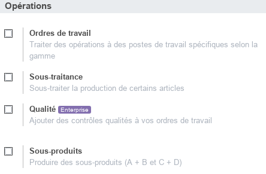
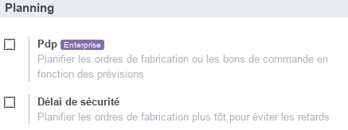
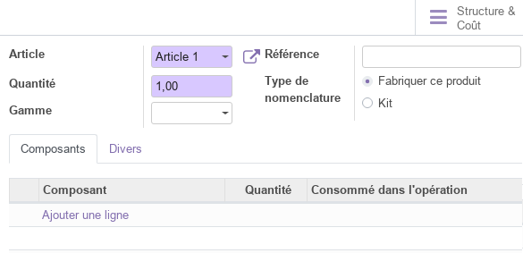
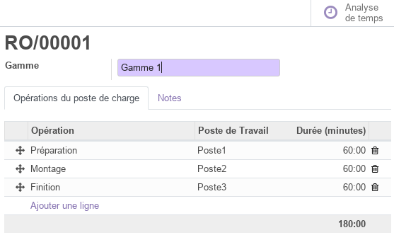
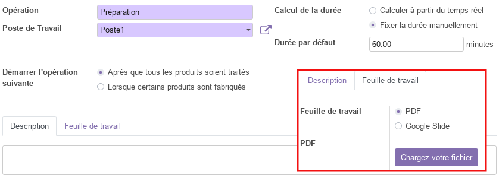
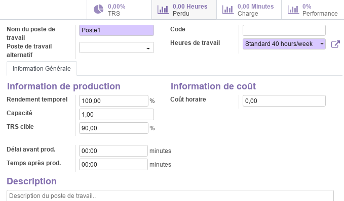
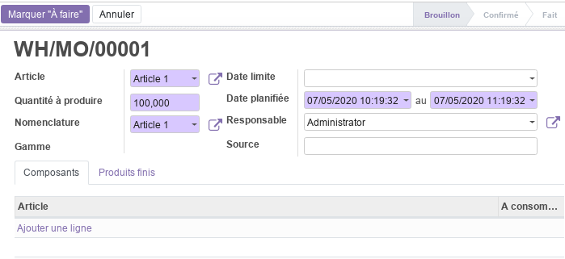

# Module Fabrication

Ce document illustre les différentes fonctionnalités du module **Fabrication** d'odoo 13 community.

## Présentation du module

Ce module est destiné à la gestion des opérations de production. Il permet :

- de gérer les nomenclatures, les itinéraires, les feuille de travail, les routes et les règles d'approvisionnement.
- d'afficher des feuilles de travail et des alertes de qualité aux travailleurs pendant les opérations.

## Configuration (admin)

Cette section, réservée aux **administrateurs** et **Gestionnaires de la fabrication**, permet de définir les paramètres généraux du module.

- L'option **_Ordres de travail_** active de nouvelles fonctionnalités permettant de gérer des opérations de fabrication qui devraient se suivre au sein des postes de travail afin de réaliser l'article. Elles sont attachées à des nomenclatures des définissent les composants requis.
- L'option **_Sous-traitance_** permet aux gestionnaires de la fabrication de faire appel à la sous-traitance.
- L'option **_Sous-produits_** permet d'ajouter des produits finis à des nomeclature de telle manière à obtenir A + B = C + D (comportement normal A + B = C).

- L'option **_Délai de sécurité_** permet de planifier les ordres de fabrication plus tôt pour éviter les retards.

## Données de base

### Articles

Cette section permet de consulter les articles gérés par l'entreprise et **pouvant être vendus et/ou achetés**. Pour plus d'informations, consulter le module [Stock / Article](./odoo-mod-stock-fr.md#articles).

Il importe de noter que pour gérer la fabrication d'un produit il est indispensable de cocher la case **_Produire_** dans les paramètres **_Stock_** de l'article correspondant.

### Nomenclatures

Les nomenclatures permettent de gérer les composants à partir desquels un article est fabriquer. Dans le cas où l'option **_Ordre de travail_** est activé, il est aussi possible d'attacher la gamme liée à l'article.

Il importe de noter que les composants sont aussi des articles dont les informations doivent être définis. Ils peuvent être achetés ou même produits à leur tour.

Pour chaque nomenclature, on peut analyser la structure de coût en lançant la commande **_Structure & coûts_**.

### Gammes

Dans le cas où l'option **_Ordre de travail_** est activé, le **Gestionnaire de la fabrication** à la possiblité de définir des gammes  qui seront par la suite liées aux articles produits par l'entreprise.

En effet, les gammes représentent l'enchainement détaillée des tâches entre les différents postes de travail. Ainsi, pour chaque opération de facbrication, on définis sont intitulé, le poste de travail correspondant, la durrée, le mode de démarrage, la description et on peut même ajouter un manuel (PDF, Slide) qui sera affiché sur le poste de l'opérateur qui effectue l'opération.

Pour chaque gamme, on peut faire une analyse du temps en lançant la commande **_Analyse de temps_**.

### Postes de charges

Les postes de charges représentent les lieux physiques où les opérations sont réalisées (ex : atelier). Pour ces postes de charge une panoplie de paramètres est disponible, tel que les heures de travail par semaine, le rendement temporel, la capacité, le coût horaire, ...

Pour chaque gamme, un ensemble d'analyses sont disponibles tel que :  **_TRS (%)_** (Taux de Rendement Synthétique), **_Perdu (Heures)_**, **_Charge (Minutes)_**, **_Performance (%)_**.

## Opérations

### Ordres de fabrication

Les ordres de fabrication représentent l'enregistrement principal des opérations de fabrication. Il comportent les informations suivantes : l'article concerné, la quantité à produire, la nomenclature à utiliser, les dates, le responsable, la source et les composants.

Cet ordre de fabrication, imprimable avec la commande **_Imprimer/Ordre de fabrication**, progresse par plusieurs état qui sont : **_Brouillon_**, **_Confirmé_**, **_Planifié_** et **_Fait_**.

En effet, une fois définis, l'ordre de fabrication peut être mis en file d'attente par la commande **_Marquer à faire_** qui fait passer sont état au stade de **_Confirmé_**.

A partir de là, le resposnable de la fabrication peut à tout moment planifier la fabrication avec la commande **_Plan_**, ce qui fait passer l'ordre de fabrication au stade de **_Planifié_** et crée automatiquement les ordres de travail pour chaque poste de charge.

Une fois que tous les travaux sont marqués comme fait au niveau des postes de charge, l'ordre de fabrication peut être **_Marqué comme fait_** et la quantité en stock est automatiquement mise à jour.

### Ordres de travail

Cette section donne accès à la liste de tous les ordres de travail enregistrés dans odoo avec leurs états : En attente, Planifié, Fait, Annulé.

### Commandes de deconstruction

Cette section permet de gérer les commandes de deconstruction. Ces dernières représentent par exemple des opérations de démontage de l'article qui sera supprimé de l'inventaire et ses composants seront réapprovisionnés en conséquence.

Cet Commandes de deconstruction, progresse par plusieurs état qui sont : **_Brouillon_** et **_Fait_**.

Une fois définis, la commande **_Deconstruction_** permet de lancer l'opération et de mettre à jour le stock automatiquement.

### Ordres de mise au rebut

Cette section permet de gérer les mises en rebut. Ces dernières représentent des produits défecteux et dont la qualité ne répond pas aux exigences du client.

Ces ordres de mise en rebut, progressent par plusieurs état qui sont : **_Brouillon_** et **_Fait_**.

Une fois définis, la commande **_Valider_** permet de lancer l'opération de mise en rebut et de mettre à jour le stock automatiquement.

## Vue d'ensemble

La vue d'ensemble donne accès un tableau de bord global des **postes de charge** permettant de visualiser de manière synthétique l'état des travaux au niveau de chaque poste (stock, en cours) et donne aussi des indications sur les performances et les problèmes.

## Analyse

La partie analyse permet aux **Gestionnaires de la fabrication** de visualiser des vues synthétiques de la situation des ordres de fabrication, des ordres de travail et du taux de rendrement synthétique sous différentes formes : tableau croisé, graphes.

## Plus de détails

- Pour la collaboration sur les formulaires de ce module, consulter la fonctionnalité [conversations](./odoo-conversations.md).
- [Site officiel d'odoo](https://www.odoo.com/fr_FR/page/purchase).  

----
[Retour au sommaire](./odoo-deploy-guidelines-fr.md)
