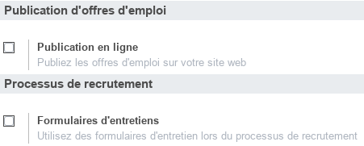
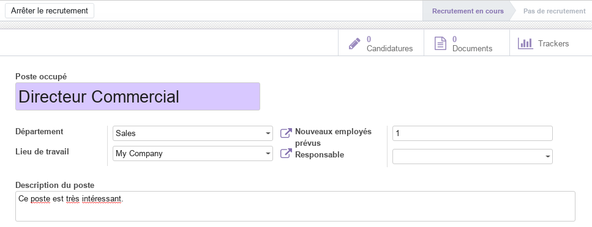
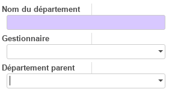
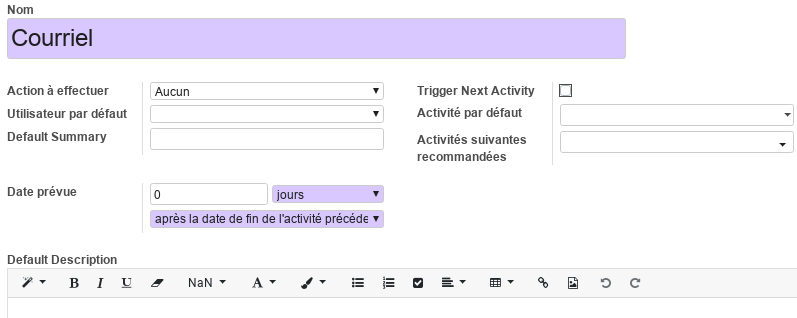
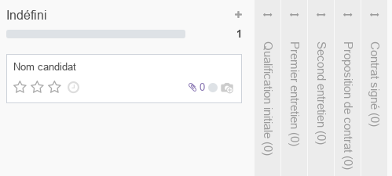
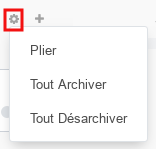
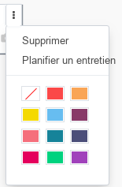
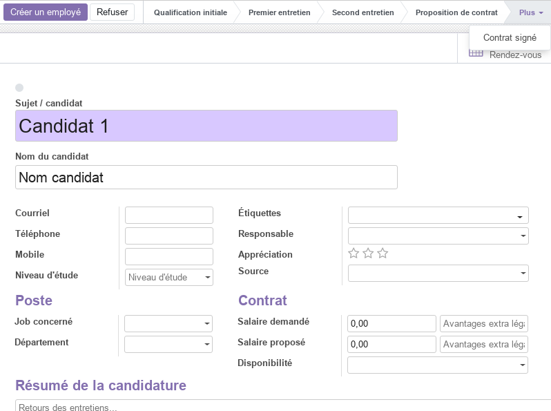
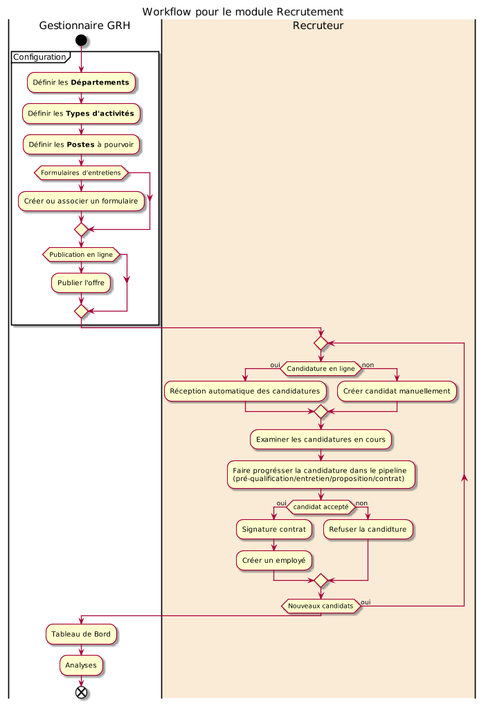

# Module Recrutement

Ce document illustre les différentes fonctionnalités du module **Recrutement** d'odoo 13 community.

## Présentation du module

Ce module est destiné à gérer le processus d'embauche de manière simplifié, de la recherche de candidat au contrat. il permet de :

- d'organiser les offres d'emploi et les candidatures.
- de configurez le tableau d'offres d'emploi, de faire la promotion ds offres et de suivez facilement les candidatures soumises.
- de suivre  chaque candidat et de créer une base de données de compétences et de profils avec des documents indexés.
- de diriger directement les applications vers la adresse électronique.
- donne le choix au postulant de vous contactent par e-mail ou en utilisent le formulaire en ligne.
- d'utilisez une vue kanban et de personnaliser les étapes du processus de recrutement : préqualification, premier entretien, deuxième entretien, négociation, etc.
- d'obtenir des statistiques précises sur le pipeline de recrutement.

## Configuration (admin)

Cette section, réservée aux **administrateurs**, permet de définir les paramètres généraux du module, tel que les les postes, les départements et les types d'activités.

### Configuration - Paramètres

- L'option **_Publication en ligne_** active de nouvelles fonctionnalités permettant aux **GRH** de publier les offres d'emploi sur le site web (Odoo) de l'entreprise.

- L'option **_Formulaires d'entretiens_** active de nouvelles fonctionnalités permettant aux **GRH** de créer des formulaires d'entretien qui seront renseignés directement par les demandeurs d'emploi. Ce module dépend du module **Enquêtes**.

### Postes

Cette section, réservée aux **responsables des ressources humaines**, permet de définir les informations relatives aux postes occupés ou à pourvoir, tel que l'intitulé le département y relatif, le nombre d'employés supposés l'occupé et sa description.

.

Pour Chaque poste, les **GRH** disposent d'un accès facile à toutes les informations utiles, tel que le nombre de candidats et les documents disponibles. Aussi, un processus en deux étapes y est associé (**_Recrutement en cours_**, **_Pas de recrutement_**) et qui peut changé d'état avec la commande **Arrêter le recrutement**.

### Départements

Cette section, réservée aux **GRH**, permet de définir la structure et la hiérarchie de l'entreprise (directions, départments, services, ...).

### Types d'activités

Cette section permet de prédéfinir l'ensemble des activités liées au processus de recrutement (et d'autres processus), tel que les appels téléphoniques, l'envoi d'emails, les rendez-vous, ...

Pour chaque activité, les paramètres suivants sont prédéfinis.

## Candidatures

### By Job Positions

Cette section donne accès un tableau de bord global mettant en évidence l'ensemble des postes à purvoir avec leurs statistiques.

### Toutes les candidatures

Cette partie offre une vue en kanban de l'ensemble des candidatures en cours. Pour chaque candidature, on peut visualiser le nom du candidat, le nombre de docuements téléchargés, la photo, un status (couleurs rouge/vert) ...

Pour chaque étape (colone) un ensemble de commandes est disponible : **_Plier_**, **_Tout Archiver_** et **_Tout Désarchiver_**. Ces colones représentent les étapes personnalisbales du processus de recrutement de l'entreprise.

Aussi, à partir du menu contextuel, on peut accéder directement aux paramètres de la candidature avec la commande **_Modifier_** et lui affecter une couleur distinctive en fonction de sont type par exemple. On peut aussi **_Supprimer_** le candidat ou **_Planifier un entretien_**.

En sélectionnant un candidat, on peut mettre à jours l'ensemble des informations y relatives tel que : le sujet, le nom, le courriel, le téléphone, le niveau d'études, le poste concerné, le salaire, ...

Pour chaque candidat, une indication claire de sa position dans le processus de recrutement est affichée. Aussi, La commande **Créer un employé** permet de créer un enregistrement employé directement à partir des informations du candidat. La commande **Refuser** permet de cloturer la candiature.  

## Analyse

La partie analyse permet aux **GRH** de visualiser des vues synthétiques sous différentes formes (listes, tableau croisé ou graphes) de la situation des **Recrutements**.

## Workflow

## Plus de détails

- Pour la collaboration sur les formulaires de ce module, consulter la fonctionnalité [conversations](./odoo-conversations.md).
- [Site officiel d'odoo](https://www.odoo.com/fr_FR/page/recruitment).  

----
[Retour au sommaire](./odoo-deploy-guidelines-fr.md)
