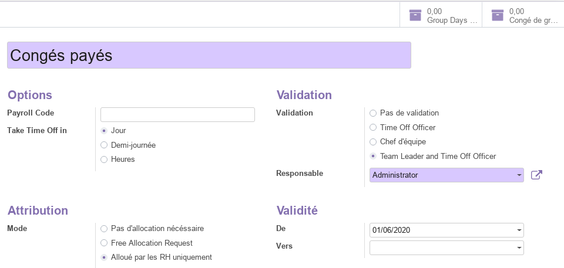
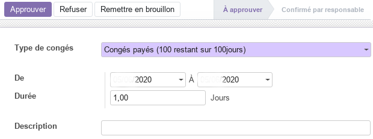
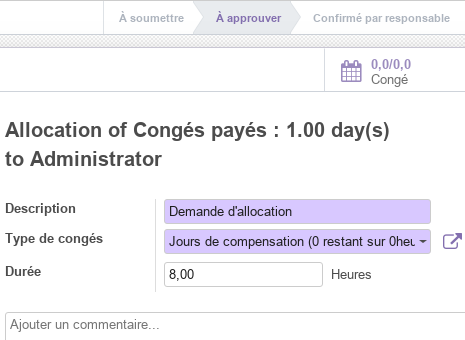
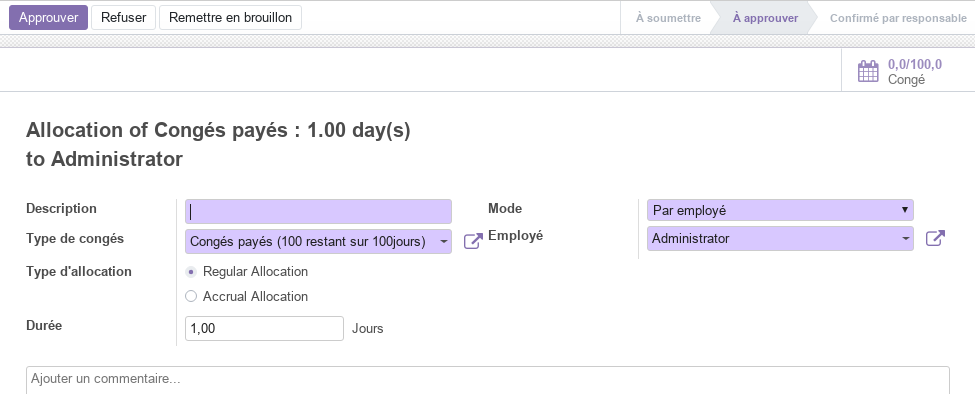
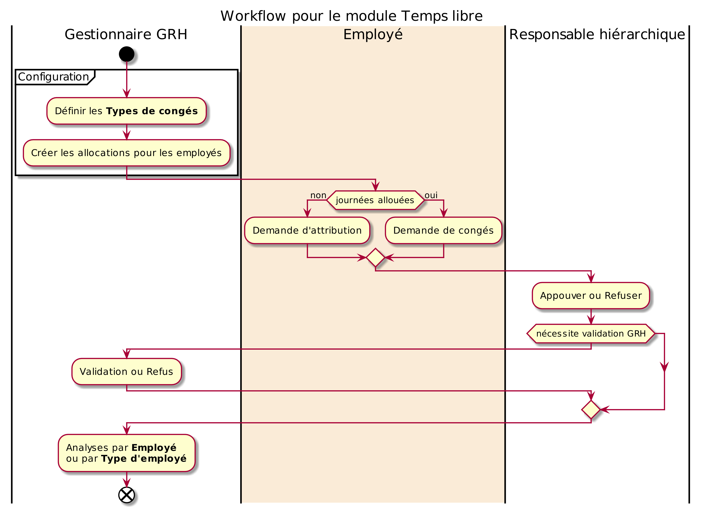

# Module Temps Libre

Ce document illustre les différentes fonctionnalités du module **Temps Libre** d'odoo 13 community.

## Présentation du module

Ce module complémentaire au module **Employés** est destiné à gérer les vacances et les absences des employés. Il permet :

- de dispoer d'une vue d'ensemble sur les congés de tous les employés et les jours de vacances pris.
- aux employés de créer des demandes et aux managers de les approuvées en quelques clics tout en mettant à jour l'agenda de chaque employé.
- aux managers de garder une vue globale des congés de leur équipes afin que celle-ci reste organisée et de pour prévoir facilement la répartition des tâches en l'absence de certains membres.
- de recevez des rapports afin de planifier à l'avance.
- de disposer d'un outil de reporting simple afin de créer des rapports en un seul clic pour chaque demande de congé, détaillés par type de demande, employé, département et même pour l'ensemble de l'entreprise.
- d'obtenir des statistiques sur les congés et de planifier au long terme afin d'assurer le maintien de la productivité à son plus haut niveau.

## Configuration (admin)

Cette section, réservée aux **administrateurs**, permet de définir les paramètres généraux du module.

### Types de congés

Cette section permet aux **GRH** de gérer les types de congés autorisés par l'entreprise. Ainsi, les **GRH** on la possibilité de renseigner toutes les informations utiles des congés légaux et spécifiques ouverts aux employés, tel que :  la durrée, le mode d'attribution, les autorités de validation et la validité.

Aussi, à partir de cette vue, les **GRH** disposent d'une synthèse simplifiée pour chaque type de congés avec **_Group Days_** et **_Congés de groupe_**.

## Mes congés

Employé
Responsable hiérarchique
Gestionnaires RH

### Tableau de bord

Cette section donne accès à une vue en calendrier ou en liste à l'ensemble des congés de l'utilsateur en cours. La vue en calendrier peut être paramétrée pour afficher les congés par jour, semaine ou mois.

En utlisant la commande **Nouvelle demande de congés** ou en sélectionnant directement les journées qui'il veut prendre sur le calendrier, l'employé peut créer une nouvelle demande de congés et renseigner les informations y afférentes.

Aussi, la commande **Nouvelle demande d'allocation** permet à l'employé de créer une nouvelle demande d'attribution et renseigner les informations y afférentes.

### Demandes de congés

Cette section permet aux employés de demander des congés pour les **types** dont le **mode** d'attribution est soit **_Pas d'allocation nécessaire_** ou **_Alloué par les RH uniquement_**.

Dans la demnade, l'employé renseigne toutes les informations utiles, tel que : le type de congés, la période et la description. Cette demande de congés progresse selon un processus en deux (02) étapes, à savoir : **à approuver** et **_Confirmé par responsable_**.

Une fois la demnade créee, et selon le mode de validation du type de congés demandé, le **Responsbale hiérarchique** de l'employé peut **Approuver** ou **Refuser** la demande en utlisant les commandes y afférentes.

Par la suite, le **GRH** doit **Valider** la demande, si son type le nécessite.

### Demandes d'attribution

Cette section permet aux employés de demander des attributions de temps libre pour les **types** dont le **mode** d'attribution est **_Free Allocation request_** (demande d'allocation libre) ou dont le nombre de jours a déjà été alloués par le **GRH**. Ainsi, l'employé renseigne les informations suivantes : description, type de congés, durée et commentaire.

Cette demande d'attribution progresse selon le processus suivant : **_à soumettre_**, **_à approuver_** et **_Confirmé par responsable_**. Pour ce faire, le **Responsable hiérarchique** et le **GRH** doivent valider cette demande pour que l'employé puisse faire des demandes de congés dans la limite des journées allouées.

## Tout le monde

Cette section donne accès à une vue en calendrier ou en liste à l'ensemble des congés des employés de l'entreprise. La vue en calendrier peut être paramétrée pour afficher les congés par jour, semaine ou mois.

## Responsables

Cette section est déstinée aux **Responsables hiérarchiques** d'accéder directement aux enregistrements de temps libres et d'attribution **à approuvés**, à liste de **Tous** les temps libres et attributions, ainsi qu'aux **Temps libres reportés sur la paie**. La liste de **Tous** les employés et les **Temps libres reportés sur la paie** ne sont accessibles qu'aux **GRH**.

La liste des demandes de temps libre (congés, attributions) **à approuver** affiche la liste des employés dont le paramètre **Gestionnaire** (fiche de l'employé) est définis sur l'utilisateur en cours.

Pour les demandes d'attribution, le **GRH** dispose de plusieurs modes d'allocation, soit **_Par employé_**, **_Par société_**, **_Par Département_** ou **_Par catégorie d'employé_**. Il peut soit **Approuver** refuser **Refuser** la demande en utlisant les commandes y afférentes.

## Analyse

La partie analyse permet aux **GRH** de visualiser des vues synthétiques sous différentes formes (listes, tableau croisé ou graphes) de la situation des **congés des employés**, soit par **employé** soit par **type**.

## Workflow

## Plus de détails

- Pour la collaboration sur les formulaires de ce module, consulter la fonctionnalité [conversations](./odoo-conversations.md).
- [Site officiel d'odoo](https://www.odoo.com/fr_FR/page/leaves).  

----
[Retour au sommaire](./odoo-deploy-guidelines-fr.md)
