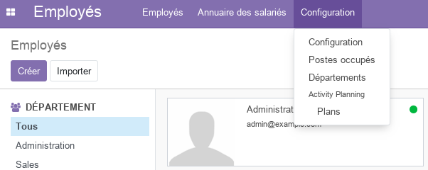
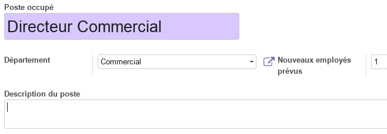
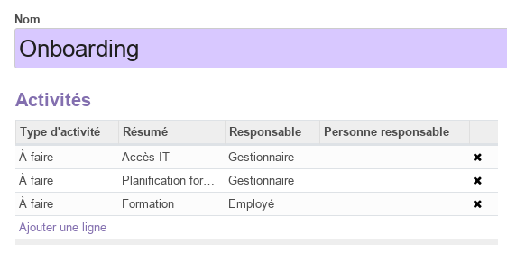
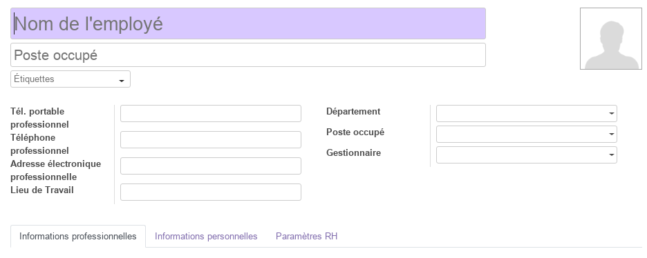
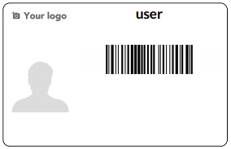

# Module Employés

Ce document illustre les différentes fonctionnalités du module **Employés** d'odoo 13 community. 

## Présentation du module 

Ce module est destiné à gérer efficacement les employés en centralisant toutes les informations relatives aux ressources humaines. Il permet de : 
- superviser toutes les informations importantes pour chaque département.
- limiter l'accès aux informations sensibles aux responsables des ressources humaines.
- de rendre certaines informations publiques, accessible à tous les employés sous forme de répertoire du personnel par exemple. 
- recevoir des alertes pour toute nouvelle demande de congés, demande d'allocation, candidature, évaluation et plus encore (en fonction des modules installés).

## Configuration (admin)

Cette section, réservée aux **administrateurs**, permet de définir les paramètres généraux du module, tel que l'organisation professionelle et les droits d'accès de l'employé à ces informations.

## Départements 

Cette section, réservée aux **responsables des ressources humaines**, permet de définir la structure et la hiérarchie de l'entreprise (directions, départments, services, ...). 

D'une manière générale, un département au sens odoo est toute unité élémentaire regroupant un ensemble d'employés. Ces départements peuvent être hiérarchisés en définissant le **département parent** et un **gestionnaire** peut être définis pour chacun d'entre eux ce qui permettra de définir les responsabilités/autorités de chaque employé.

## Postes occupés 

Cette section, réservée aux **responsables des ressources humaines**, permet de définir les informations relatives aux postes occupés par les employés, tel que l'intitulé le département y relatif, le nombre d'employés supposés l'occupé et sa description.

## Plans 

Cette section, réservée aux **responsables des ressources humaines**, permet de définir les plans (parcours) standardisés, définis par l'entreprise, relatifs à la gestion de la ressource humaine, tel que :
* l'intégration/installation d'un employé dans un nouveau poste (OnBoarding),
* et le départ d'un employé (OffBoarding). 

Le responsable des ressources humaines peut créer plusieurs plans en fonction des processus métier de l'entreprise. Pour cela, il suffit de **_créer_** un nouveau plan et de définir les activités y relatif. 

Les types d'activités peuvent être définis dans la section [Configuration / Paramètres généraux / Messages / Activités](./odoo-configuration-fr.md#messages).

## Emlpoyés 

Cette section, réservée aux **responsables des ressources humaines**, permet de gérer les informations relatives aux employés de l'entreprise.

Les sections **_Informations professionelles_** et **_Informations personnelles_** contienent les données standards de l'employé, tel que le Lieu de travail, le mentor, les contacts, l'état civil, l'éducation, ... 

La section **_Paramètres RH_** permet de **_lier_** l'employé à un utilisateur et de **_Générer_** un identifiant de badge en fonction du nom. Une fois l'identifiant du badge généré, les **responsables des ressources humaines** peuvent l'imprimer directement en format PDF.

## Annuaire des salariés

L'annuaire des salariés est disponibles à tous les **utilistateurs internes** de l'entreprise afin de faciliter l'accès aux informations essentielles tel que les contacts. Les informations personnelles et les paramètres RH des employés ne sont pas accessibles.

# Plus de détails 

- Pour la collaboration sur les formulaires de ce module, consulter la fonctionnalité [conversations](./odoo-conversations.md).
- [Site officiel d'odoo](https://www.odoo.com/fr_FR/page/employees).  

----
[Retour au sommaire](./odoo-deploy-guidelines-fr.md)