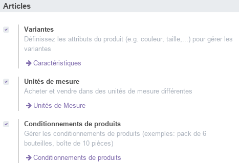
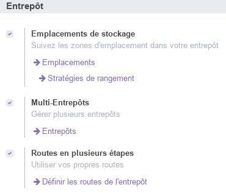
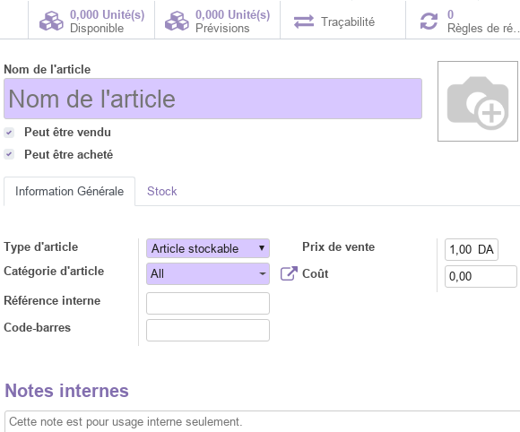

# Module Stock

Ce document illustre les différentes fonctionnalités du module **Stock** d'odoo 13 community. 

## Présentation du module 

Ce module est destiné à optimisez l'organisation des entrepôts de l'entreprise grâce à un système d'inventaire intelligent de double entrée. Il permet d'optimisez toutes les opérations internes, et d'obtenir la méthode de stockage la plus efficace possible. L'inventaire en double entrée d'Odoo n'a pas de saisie, de sortie ou de transformation de stock. A la place, toutes ces opérations consistent en des mouvements d'inventaire entre les emplacements disponibles.

## Configuration (admin)

Cette section, réservée aux **administrateurs** et **Gestionnaires des stocks**, permet de définir les paramètres généraux du module, tel que les opérations (prépération par lots, Colis), les confirmations d'expédition (email, SMS), les options des articles, la traçabilité et les entrepots.

### Configuration des Articles

Cette section permet de définir les paramètres des articles tel que les variantes, les unités de mesures et le conditionnement de produits. 

* les variantes : si cette option est selectionnée, le **gestionnaire des stocks** aura la possibilité de prédéfinir des caractéristiques communes pour les articles (couleur, options, ...). Pour chaque caractéristique un ensemble de valeurs est prédéfini. 

* les unités de mesures : si cette option est sélectionnée, le **gestionnaire des stocks** aura la possibilité de prédéfinir des unités de mesures utilisables pour les articles (km, kg, ...). 

* le conditionnement de produits : si cette option est sélectionnée, le **gestionnaire des stocks** aura la possibilité de prédéfinir des modèles de conditionnement pour les articles (packs de 4/6/8/...). 

### Configuration des Entrepots

Cette section permet de définir les paramètres des entrepots tel que les emplacements, le multi-entrepots et les routes. 

* Emplacements de stockage : si cette option est selectionnée, le **gestionnaire des stocks** aura la possibilité de prédéfinir des emplacements spécifiques dans chaque entrepot pour ranger les articles selon la **_stratégie de rangement définie_**. 

* Multi-Entrepots : si cette option est selectionnée, le **gestionnaire des stocks** aura la possibilité d'ajouter autant d'entrepots qu'il le souhaite. Sinon **un seul** entrepot sera disponible pour le stockage, celui de l'entreprise. 

* Routes en plusieurs étapes : si cette option est selectionnée, le **gestionnaire des stocks** aura la possibilité de prédéfinir des routes (étapes) standards par lesquelles les articles sont acheminés, ainsi que les règles associées.

## Entrepots

Cette section permet de renseigner les informations relatives à l'entrepot principal de l'entreprise et aux autres entrepots si l'option [Multi-Entrepots est activé](#configuration-des-entrepots) (identification, nom sourt, adresse).

## Types d'opérations 

Cette section permet de définir les types d'opérations affectant les stocks tel que la réception et la livraison.

Les opérations peuvent avoir un code, un type (Reçu, Livraison, Transfert interne) et être associées à des opérations de retours.

## Catérogies d'articles 

Cette section permet de définir une **hiérarchie** des catégories d'articles gérés par l'entreprise, tel que les articles disponibles à la vente, les matières premières, les fournitures, ...

## Données de base

Le menu Données de base permet de resneigner les informations relatives aux **_Articles_** et aux **_Règles de réapprovisionnement_**. 

### Articles 

Cette section permet de renseigner les informations relatives à tous les articles gérés par l'entreprise. 

Les articles peuvent être vendu et/ou acheté et selon leur type (consommable, service, stockable) des informations relatives à leur stockage peuvent être renseignées.

### Règles de réapprovisionnement 

Les règles de réapprovisionnement définissent, pour chaque article, les quantités min/max ainsi que les délai de réception/achat.

## Opérations 

Le menu opération permet de resneigner les informations relatives aux **_Transferts_**, **_Adjustement de stock_** et les **_Rebuts_**. Il permet aussi de **_lancer le planificateur_** afin de créer les opérations nécessaires au réapprovisionnement des stocks selon les régles prédifinis dans les [Données de base](#données-de-base). 

---

### Transferts

### Adjustement de stocks

(inventaires)

### Rebuts

### Planificateur 

## Analyse 

## Vue d'ensemble 

# Plus de détails 

- Pour la collaboration sur les formulaires de ce module, consulter la fonctionnalité [conversations](./odoo-conversations.md).
- [Site officiel d'odoo](https://www.odoo.com/fr_FR/page/warehouse).  

----
[Retour au sommaire](./odoo-deploy-guidelines-fr.md)